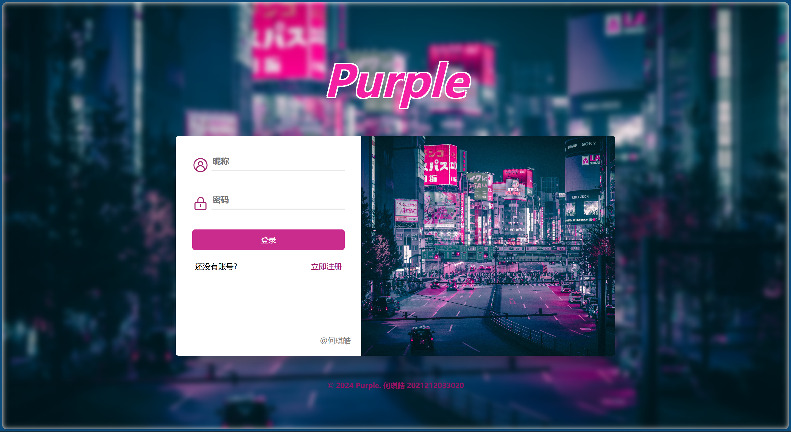

# Purple：*Web-Blogs*


此工程为《基于平台的软件开发》结课大作业而开发，是一个基于Vue2和nodejs的前后端分离的web博客系统，取名为**Purple**。文件存储使用**json**文件，不需要数据库。

用户可以在网站注册账号，登录后可以查看**全部用户在网站上发布的全部博文**，还可以查看单个博文的详细内容。其中支持对自己博文的操作，包括创建博文，编辑博文，删除博文，另外还支持按作者名和博文标题**搜索**。

此外，还设置了一个管理员页面，使用管理员账号登录即可查看所有用户信息，支持增添、删除用户，修改用户信息，另外还支持用户名**搜索**。

工程全部由中国传媒大学21计科何琪皓完成。

## 主要页面展示
> 登录页



---

> 主页/全部博文显示页


---

> 博文页


---

> 管理员页


## 工程代码说明

#### 数据定义
**用户**`users.json`**数据结构定义：**`{"name":" ","password":" "}`
**博文**`posts.json`**数据结构定义：**`{"name":" ","title":" ","text":" ","time":" ","id":" "}`

#### 代码结构

```
blogs
│
├─data
│   ├─ posts.json       //存放博文信息
│   └─ users.json       //存放用户信息
│ 
├─server                            //服务器端代码!!!
│   ├─  addpostToJsonFile.js        //添加博文，将博文信息写入json文件
│   ├─  adduserToJsonFile.js        //添加用户，将用户信息写入json文件
│   ├─  deletePostFromJsonFile.js   //删除博文，在json文件中删除博文信息
│   ├─  deleteUserFromJson.js       //删除用户，在json文件中删除用户信息
│   ├─  findPostFromJsonFile.js     //根据作者名查找博文
│   ├─  findPostidFromJsonFile.js   //根据博文id来找单个博文具体内容
│   ├─  findUserFromJsonFile.js     //根据用户名来找用户         
│   ├─  server.js                   //服务器API配置文件，包括用户登录、注册、博文的增删改查、管理员对用户的增删查改的入口，连接前端和json文件
│   ├─  updatePostInfo.js           //更新博文标题、正文、时间信息
│   ├─  updateUserInfo.js           //更新用户的用户名和密码信息
│   └─  writeJson.js                //在服务器启动时创建用户和博文两个json文件，并放入初始数据
└─src           
    ├─ main.js              //入口文件
    │
    ├─router
    │   └─ index.js         //路由配置
    │
    └─views
        ├─ Admin.vue        //管理员页面，可以查看所有用户信息，删除用户，修改用户信息
        ├─ CreatePost.vue   //创建博文页面
        ├─ EditPost.vue     //编辑博文页面
        ├─ Homepage.vue     //主页
        ├─ Login.vue        //登录页面
        ├─ Post.vue         //博文页面
        ├─ Register.vue     //注册页面
        │
        ├─fonts             //矢量图和字体文件
        │
        └─img               //背景图文件
```

#### 后端说明
- 服务器端使用nodejs的**express**框架，提供API接口，能实现前后端分离。核心文件在`server`文件夹中:heavy_exclamation_mark:。
- 核心代码在`server`文件夹中的`server.js`文件中，设置了包括用户登录、注册、博文的增删改查、管理员对用户的增删查改等功能的接口。其每个功能的具体文件系统操作实现在`server`文件夹中的其他文件中，供`server.js`做函数调用，每个文件的功能说明在代码结构中已展示。 
- 在启动vue项目之前，要先启动node服务器，服务器在3000端口：http://localhost:3000/{api_name}。
- 启动node服务器后会在根目录下的`data`:heavy_exclamation_mark:文件夹下自动创建两个json文件，分别存放用户信息和博文信息，初始写入数据在`writeJson.js`中定义。


#### 前端说明
- 前端使用**Vue2**，核心代码在`src`文件夹中，路由定义在`router/index.js`中，页面文件在`views`文件夹中。
- 登录页面`Login.vue`和注册页面`Register.vue`结构类似，设置了基本的逻辑错误提示，登录成功后会跳转到主页`Homepage.vue`。
- 在`Homepage.vue`页中会展示所有用户的博文，点击单个博文框即可跳转到博文展示页`Post.vue`，此外可以点击创建按钮跳转到`CreatePost.vue`进行创建。
- 在`Post.vue`页中，假如是用户自己创建的博文，可以通过编辑按钮跳转到`EditPost.vue`进行编辑。
- 管理员页面`Admin.vue`中可以查看所有用户信息，删除用户，修改用户信息。
- 页面中使用的所有矢量图来自阿里矢量图标库iconfont,存放在`views/fonts`文件夹中，背景图文件放在`views/img/`文件夹中。
- 前端静态资源已经全部用build打包，放在了根目录下的`purple`文件夹中，可以直接通过`purple/index.html`访问页面，在启动node服务器状态下可以正常使用网站。如果想要将前端运行在tomcat等服务器上，需要将`purple`文件夹中的文件放入服务器的webapp目录下，启动服务器后访问http://localhost:8080/purple/#/login :heavy_exclamation_mark:

## 使用说明

- 进入`blogs/server`,启动服务器。你可以在终端中执行:
```
node server.js
```
- 若不部署前端服务器，则可以直接浏览器打开`purple/index.html`，即可使用网站.

- 如果想要将前端运行在tomcat服务器上，需要将`purple`文件夹放入服务器的`webapp`目录下，启动服务器后访问，运行`startup.sh`后浏览器访问地址http://localhost:8080/purple/ 即可使用网站。


